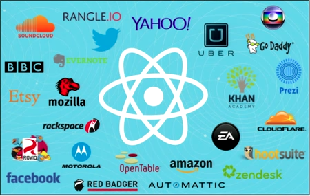

# react europe

## 2015


<!--
```javascript
  React.render(
    <h1>Hello, tolingo!</h1>,
    document.getElementById('tolingo-dev')
  );
```
-->

[Website](https://www.react-europe.org/2015.html)

[YouTube Channel](http://www.youtube.com/channel/UCorlLn2oZfgOJ-FUcF2eZ1A)

Notes:
Watch the videos yourself, if you decide you really want to dive into a topic. To get us all started, let us start like the conference with the keynote.


### Keynote

> Hot Topics in the React Universe.



> Data, Language, Packager, Target.

Notes:
- Data: Flux, One-Way Data Flow, ClojureScript, Om Next, Relay & GraphQL
- Language: Babel, ESlint, TypeScript, Flow, Gradual Typing, Optimizing Transpiler, WebAssembly
- Packager: npm + webpack, incremental updates, hot swapping, improve DX
- Target: VirtualDOM => DOM, SVG, Canvas, Terminal, iOS, Android

All in all: »Go go React!!! Go go Community!!!!«

- The video: https://www.youtube.com/watch?v=PAA9O4E1IM4
- The dude: [Christopher Chedeau](http://blog.vjeux.com/)


### Inline Styles

> There has never been a better time not to learn CSS.

```javascript
let doneStyle = { textDecoration: 'line-through' };

function render () {
  return <li style={ item.done ? doneStyle : '' }></li>
};
```

- Style is not CSS.
- Reuse (components), not repurpose (CSS).
- HTML (attributes), JS (objects), CSS (classes) but where is the state?
- Answer: It is all JavaScript/ClojureScript/Elm...

Notes:
- Some very good points and explanations
- Easy: variables, some pseudo-classes (`map` + `Math`, e.g. `:first-child` => `i == 0`)
- Hard: `:hover`, media-classes
- Help for good defaults: [Radium](https://github.com/FormidableLabs/radium)
- Learn by example: [Soundcloud's react-soundplayer](https://github.com/soundblogs/react-soundplayer)
- Quote from [Jeremy Ashkenas "Rise of Transpilers"](https://www.youtube.com/watch?v=DspYurD75Ns) basically announcing something like [Elm](http://elm-lang.org/), see [Screenshot](resources/jeremy-ashkenas-quote.png)
- The dude: [Michael Chan](https://twitter.com/chantastic)
- The video: https://www.youtube.com/watch?v=ERB1TJBn32c


### React Router

- The dude: [Michael Jackson](https://twitter.com/mjackson)
- [Training](https://reactjs-training.com/): Apple, PayPal, Netflix...
- Why?
  - **copyable** URLs
  - Transitions w/o full reload
  - Coming from using `EmberJS`
- `v1.0`:
  - Animated transitions
  - purer (more declarative) API
  - Server-side rendering by `location`
  - Dynamic dependency loading

Notes:
- Animated transitions **and** good URLs, yay!


### Don't Rewrite, React!


Notes:
- Siehe CouchDB Vorgehen
- Really nice talk. Definitely go watch this
- Example: Use React in footer of Backbone TodoMVC (Template, EventListener)
- What does an approach like this look like with AngularJS or others?
- The dude: [Ryan Florence](https://twitter.com/ryanflorence)
- Colleague of [Michael Jackson](https://twitter.com/mjackson) at [React.js Training](https://reactjs-training.com/)
- The video: https://www.youtube.com/watch?v=BF58ZJ1ZQxY


### Live React: Hot Reloading with Time Travel

- The dude: [Dan Abramov](https://twitter.com/dan_abramov)
- The repo: [React Hot Loader](https://github.com/gaearon/react-hot-loader)
- The video: https://www.youtube.com/watch?v=xsSnOQynTHs
- Example: https://github.com/janraasch/react-hot-boilerplate


### State of React + QA


### Relay & GraphQL


### Building Submarines that don't leak


### Transpiling


### Flux (Isomorphic or otherwise)

- Früher was web immer flux! ;)
- Jetzt ist es mega kompliziert


### Animation
